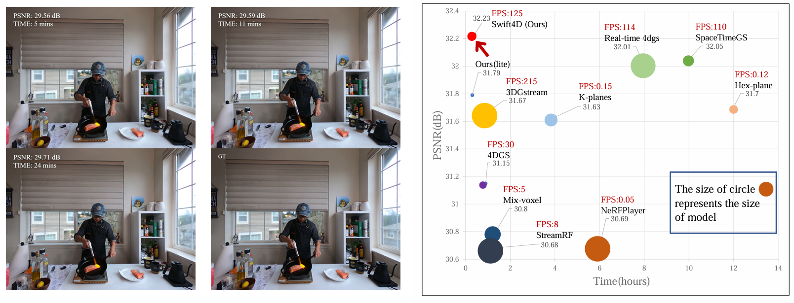
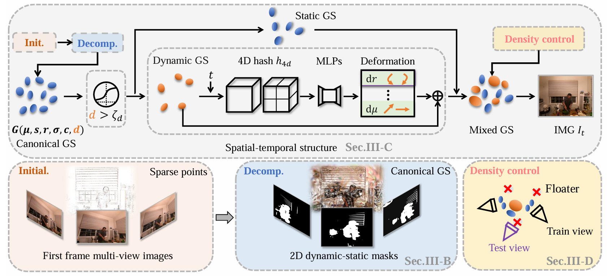

# Swift4D: Adaptive divide-and-conquer Gaussian Splatting for compact and efficient reconstruction of dynamic scene
Jiahao Wu , [Rui Peng](https://prstrive.github.io/) , Zhiyan Wang, Lu Xiao, </br> Luyang Tang, Kaiqiang Xiong, [Ronggang Wang](https://www.ece.pku.edu.cn/info/1046/2147.htm) <sup>✉</sup>
## ICLR 2025 [Paper](https://openreview.net/pdf?id=c1RhJVTPwT)


## Environmental Setups

Please follow the [3D-GS](https://github.com/graphdeco-inria/gaussian-splatting) to install the relative packages.

```bash
git clone --recursive https://github.com/WuJH2001/swift4d.git
cd swift4d
conda create -n swift4d python=3.8
conda activate swift4d

pip install -r requirements.txt
pip install  submodules/diff-gaussian-rasterization
pip install  submodules/simple-knn
```
 After that, you need to install [tiny-cuda-nn](https://github.com/NVlabs/tiny-cuda-nn).

## Data Preparation

**For real dynamic scenes:**

[Plenoptic Dataset](https://github.com/facebookresearch/Neural_3D_Video) could be downloaded from their official websites. To save the memory, you should extract the frames of each video and then organize your dataset as follows.

```
├── data
│   | dynerf
│     ├── cook_spinach
│       ├── cam00
│           ├── images
│               ├── 0000.png
│               ├── 0001.png
│               ├── 0002.png
│               ├── ...
│       ├── cam01
│           ├── images
│               ├── 0000.png
│               ├── 0001.png
│               ├── ...
│     ├── cut_roasted_beef
|     ├── ...
```
**For your Multi-view dynamic scenes:**
You may need to follow [3DGSTream](https://github.com/SJoJoK/3DGStream)


## Training

For training dynerf scenes such as `cut_roasted_beef`, run
```python
# First, extract the frames of each video.
python scripts/preprocess_dynerf.py --datadir data/dynerf/cut_roasted_beef
# Second, generate point clouds from input data.
bash colmap.sh data/dynerf/cut_roasted_beef llff
# Third, downsample the point clouds generated in the second step.
python scripts/downsample_point.py data/dynerf/cut_roasted_beef/colmap/dense/workspace/fused.ply data/dynerf/cut_roasted_beef/points3D_downsample2.ply
# Finally, train.
python train.py -s data/dynerf/cut_roasted_beef --port 6017 --expname "dynerf/cut_roasted_beef" --configs arguments/dynerf/cut_roasted_beef.py 
```

## Rendering

Run the following script to render the images.

```
python render.py --model_path output/dynerf/cut_roasted_beef --skip_train --skip_video --iteration 13000 --configs  arguments/dynerf/cut_roasted_beef.py
```

## Evaluation

You can just run the following script to evaluate the model.

```
python metrics.py --model_path output/dynerf/coffee_martini/
```
## Trained Models

You can find our dynerf models [here](https://1drv.ms/f/c/80737028a7921b70/EoI6KahH9KlKrZMvJ0eBGqgBSGiB-Ag0cVHpxXxb1AM_4A?e=dtkW2e).
The VRU Basketball dataset we used in the paper can be found [here](https://github.com/WuJH2001/VRU-Basketball). You can also download our Basketball dataset from 🤗 Hugging Face [here](https://huggingface.co/datasets/BestWJH/VRU_Basketball). Feel free to use it for training your model or validating your method!


## Contributions

**This project is still under development. Please feel free to raise issues or submit pull requests to contribute to our codebase. Thanks to [4DGS](https://github.com/hustvl/4DGaussians)** 

---

## Citation


```
@inproceedings{wuswift4d,
  title={Swift4D: Adaptive divide-and-conquer Gaussian Splatting for compact and efficient reconstruction of dynamic scene},
  author={Wu, Jiahao and Peng, Rui and Wang, Zhiyan and Xiao, Lu and Tang, Luyang and Yan, Jinbo and Xiong, Kaiqiang and Wang, Ronggang},
  booktitle={The Thirteenth International Conference on Learning Representations}
}
```
